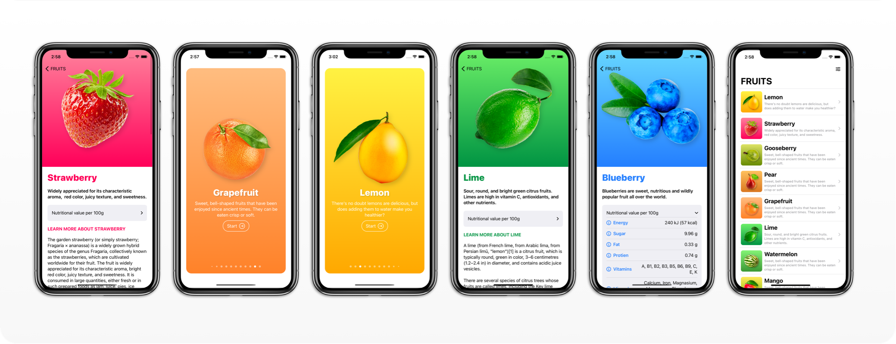

# Fructus


### SwiftUI 2.0 practice.

<p float="left">
      
</p>

## New Concepts used:

#### SVG file: 
```
Starting Xcode 12.0 you can use svg based assets in your app.
```
<br/>

#### Accent color:
```
The default accent color for the entire app can be changed now.
```

<br/>

#### PageTabViewStyle
```
A TabViewStyle that implements a paged scrolling TabView.
```

<br/>

#### App protocol 
```
A new protocol that represents the structure and behavior of an app.
```

<br/>

#### AppStorage
```
A property wrapper type that reflects a value from UserDefaults and updates UI based on value chanegs.
```

<br/>

### Title2
```
A new case in the FontStyle enum. To be used in second level hierarchy of view. (Ex: subtitle)
```

<br/>

#### GroupBox 
```
A stylized view with an optional label that is associated with a logical grouping of content.
```

<br/>

#### Link
```
A new easy to implement control to naviagate to any URL.
```

<br/>

#### DisclosureGroup 
```
A view that shows or hides another content view, based on the state of a disclosure control.
```
